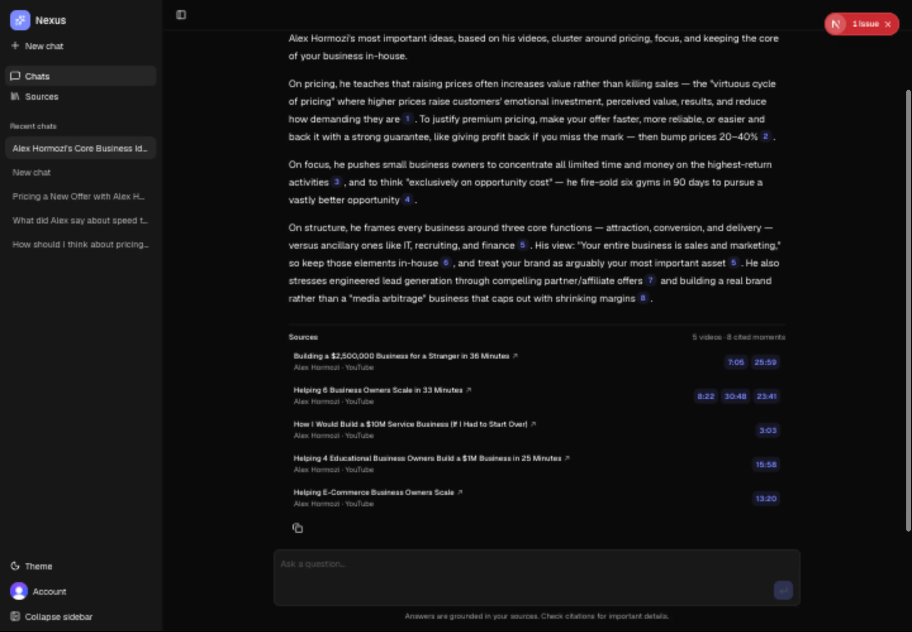

<div align="center">
  
  <h1>Nexus</h1>
  <p><strong>Ask a creator's entire catalog. Get grounded answers with proof.</strong></p>
  <p>
    Nexus turns long-form YouTube content into a searchable knowledge base, then answers questions
    with citations that deep-link to the exact moment each claim came from.
  </p>
  <p>
    <a href="https://nexus-ten-teal.vercel.app"><strong>Live demo</strong></a>
    ·
    <a href="docs/ARCHITECTURE.md">Architecture</a>
    ·
    <a href="docs/DESIGN.md">Product design</a>
    ·
    <a href="CONTRIBUTING.md">Contributing</a>
  </p>
  <p>
    
    
    
    
  </p>
</div>



## Why Nexus

Creator knowledge is usually trapped inside hours of video. Generic chat tools can summarize a
transcript, but they make it difficult to verify where an answer came from. Nexus is built around
the opposite contract: retrieve first, answer from evidence, and make every citation inspectable.

- **Grounded answers** — claims come from the authenticated user's ingested catalog.
- **Timestamp citations** — each source opens the relevant YouTube moment.
- **Hybrid retrieval** — dense vector search and Postgres full-text search are fused and reranked.
- **Context-aware chunks** — retrieval blurbs preserve the meaning that isolated transcript slices lose.
- **Durable conversations** — Mastra owns memory, tool calls, persistence, and thread titles.
- **Private by default** — Clerk authentication and server-side ownership checks scope data to its user.

## How it works

```text
YouTube channel
  → timestamped transcripts
  → contextual chunks + embeddings
  → Postgres full-text + pgvector search
  → reciprocal-rank fusion + reranking
  → neighboring context
  → Mastra agent
  → streamed answer + exact source moments
```

The web client sends only the newest message and thread ID. The server authenticates the request,
verifies thread ownership, and hands the turn to the Mastra agent. When catalog evidence is needed,
the agent calls one search tool whose output drives both the answer and the citation UI.

## Stack

| Layer | Technology |
| --- | --- |
| App | Next.js 15, React 19, TypeScript, Tailwind CSS |
| AI | Mastra, Vercel AI SDK, AI Gateway |
| Retrieval | pgvector, Postgres full-text search, RRF, cross-encoder reranking |
| Data | Postgres, Drizzle ORM |
| Auth | Clerk |
| Ingestion | YouTube transcripts, AssemblyAI fallback, Workflow DevKit |
| Quality | Vitest, TypeScript, Mastra evals |

## Run locally

### 1. Install

```bash
git clone https://github.com/builtbyrishabh/nexus.git
cd nexus
pnpm install
cp .env.example .env.local
```

### 2. Configure

At minimum, add a Postgres connection, Clerk keys, and an AI Gateway key to `.env.local`. The database
must support the `vector` extension.

```bash
pnpm db:setup
pnpm db:push
```

### 3. Start

```bash
pnpm dev
```

Open [localhost:3000](http://localhost:3000), sign in, open **Sources**, and import a YouTube
channel. Sources imported in the app are attached to the signed-in user's private library. Once the
import completes, open **Chats** and ask a question.

For development or catalog maintenance, the CLI can ingest canonical source data directly:

```bash
pnpm ingest --channel @creator
```

CLI ingestion does not attach sources to a Clerk user, so those sources do not appear in a user's
library unless ownership is assigned separately. Use the Sources page for the normal product flow.

AssemblyAI transcription is an opt-in fallback for videos without captions. Set
`TRANSCRIBE_FALLBACK=true` only when you intend to use it.

## Quality checks

```bash
pnpm typecheck
pnpm test
pnpm build
```

`pnpm eval` runs the production agent against grounded-answer cases and scores faithfulness, answer
relevancy, and context precision.

## Pre-launch limits

- Chat requests are limited to 8,000 text characters and the latest 20 messages are sent to the model.
- Each user may send 100 chat messages and start 3 imports or retries per UTC day. These per-user limits do not
  replace provider budgets or an edge-level global rate limit.
- Imports embed and contextualize transcript chunks, so they can incur AI provider charges even when
  paid transcription fallback is disabled.
- Before deploying, run `pnpm db:setup && pnpm db:push` against the production database, configure
  Clerk and provider credentials, set provider spending limits, and smoke-test one signed-in import
  and cited chat response.

## Architecture

The key design rule is simple: use native library behavior for chat and own custom code only where
the product needs differentiated retrieval or verifiable citations. The full request path, data
contracts, retrieval pipeline, and tradeoffs live in [docs/ARCHITECTURE.md](docs/ARCHITECTURE.md).

## License

[MIT](LICENSE) © 2026 Rishabh Singh
